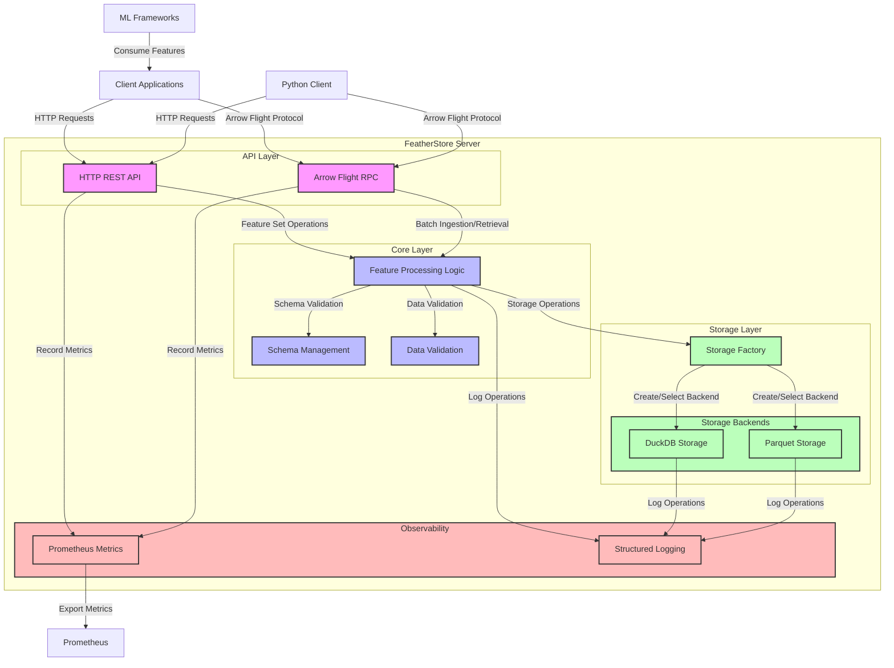
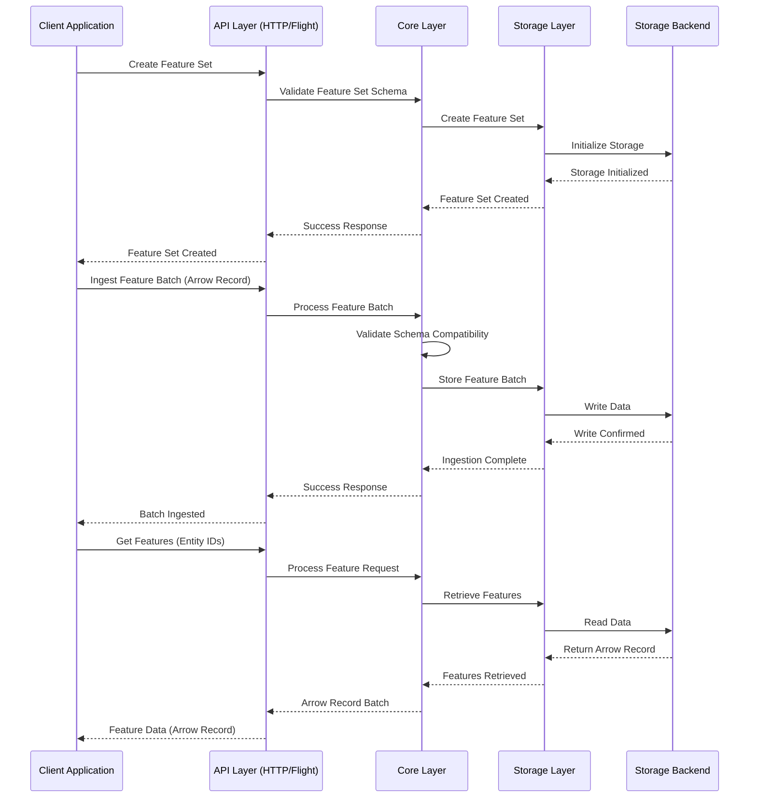

# FeatherStore

A high-performance, real-time ML feature store optimized for low-latency serving and efficient storage, built using modern Go.

## Features

- **Real-time Feature Ingestion**: Accept Apache Arrow RecordBatches via Arrow Flight RPC
- **Efficient Storage**: Multiple storage backends including DuckDB and Parquet
- **Low-latency Serving**: High-throughput feature retrieval via Arrow Flight
- **ML Framework Integration**: Compatible with TensorFlow, PyTorch, and Ray
- **Observability**: Prometheus metrics, structured logging, and OpenTelemetry tracing

## Architecture

FeatherStore follows a clean architecture approach with these primary components:

- **API Layer**: HTTP/REST API and Arrow Flight RPC for feature ingestion and retrieval
- **Core Layer**: Core domain logic for feature handling, validation, and transformation
- **Storage Layer**: Pluggable storage backends including:
  - **DuckDB**: Fast, in-memory SQL database for high-performance queries
  - **Parquet**: Native Parquet file storage for efficient columnar data storage
- **Metrics & Observability**: Prometheus metrics, logging, and tracing

### System Architecture Diagram



### Data Flow Diagram



## Storage Options

FeatherStore supports multiple storage backends, each with its own strengths:

### DuckDB Storage

DuckDB provides an in-memory SQL database that excels at analytical queries and offers:

- Fast query performance with SQL capabilities
- Low latency for feature retrieval
- Integration with Arrow for efficient data exchange

### Parquet Storage

The Parquet storage backend provides:

- Efficient columnar storage with high compression ratios
- Excellent performance for analytical workloads
- Schema evolution capabilities
- Compatibility with big data ecosystems
- Time-based partitioning of feature data
- Support for various compression algorithms (Snappy, GZIP, ZSTD, etc.)

## Getting Started

### Prerequisites

- Go 1.24+
- Apache Arrow libraries

### Installation

```bash
go get github.com/TFMV/featherstore
```

### Configuration

FeatherStore is configured via environment variables or a configuration file:

```yaml
storage:
  # Choose your storage backend
  backend: "duckdb"  # or "parquet"
  
  duckdb:
    path: ./data/features.db
    memory_limit: 4GB
    
  parquet:
    directory: ./data/features
    row_group_size: 8192
    compression: "snappy"  # Options: snappy, gzip, zstd, brotli, lz4
    
server:
  http_port: 8080
  flight_port: 8081
  
metrics:
  prometheus_port: 9090
```

## Usage Examples

### Ingesting Features

```go
// Go client example
client := featherstore.NewClient("localhost:8081")
batch := arrow.NewRecordBatch(...)
err := client.IngestFeatures(ctx, "user_features", batch)
```

### Retrieving Features

```go
// Go client example
client := featherstore.NewClient("localhost:8081")
features, err := client.GetFeatures(ctx, "user_features", []string{"user_123"})
```

### Using Historical Features

```go
// Go client example
client := featherstore.NewClient("localhost:8081")
startTime := time.Now().Add(-24 * time.Hour) // 1 day ago
endTime := time.Now()
features, err := client.GetFeatureHistory(ctx, "user_features", "user_123", startTime, endTime)
```

## License

This project is licensed under the MIT License - see the [LICENSE](LICENSE) file for details.
